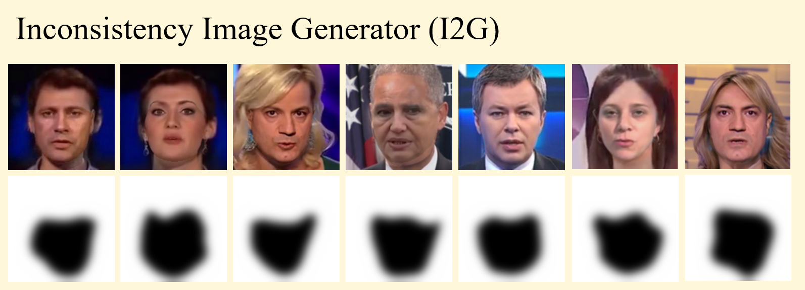
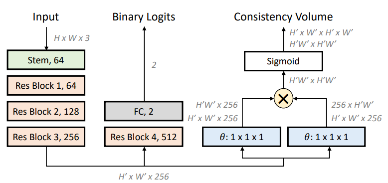
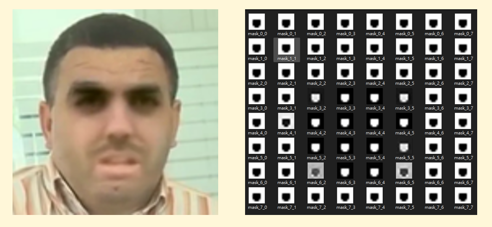

# PCL-I2G
Unofficial implementation of paper: [Learning Self-Consistency for Deepfake Detection](https://arxiv.org/pdf/2012.09311.pdf) (ICCV2021)



* Forked/Modified from [chail/patch-forensics](https://github.com/chail/patch-forensics) (Thanks!)

## Installation
1. create conda environment with Python=3.7
    ```bash
    conda create -n PCL-I2G python=3.7
    conda activate PCL-I2G
    ```
2. install pytorch 1.9.0, torchvision 0.10.0 with compatible cuda version
    ```bash
    pip install torch==1.9.0+cu111 torchvision==0.10.0+cu111 -f https://download.pytorch.org/whl/torch_stable.html
    ```
3. install required packages
    ```bash
    pip install -r requirements.txt
    ```

## Dataset
Basically any real data works on the methodology, but here I use FaceForensics++.
* [FaceForensics++](https://github.com/ondyari/FaceForensics)

## Pre-processing
1. extract frames from videos (with [ffmpeg](https://www.ffmpeg.org/))
2. Download dlib landmark predictor
    ```bash
    # dlib facial landmarks predictor
    wget https://github.com/davisking/dlib-models/raw/master/shape_predictor_68_face_landmarks.dat.bz2
    bzip2 -d shape_predictor_68_face_landmarks.dat.bz2
    ```
3. run data/preprocessing/faceforensics_process_frames.py
    ```bash
    python -m data.processing.faceforensics_process_frames.py \
        --source_dir_manipulated $manipulated \
        --source_dir_original $original \
        --outsize $outsize \
        --output_dir $out\
        --split resources/splits/train.json
        # --split resources/splits/val.json
        # --split resources/splits/test.json
    ```
    or run scripts/preprocess.sh
    ```bash
    bash scripts/train.sh
    ```

## Inconsistency Image Generator (I2G)

1. run generate_I2G.py
    ```bash
    python generate_I2G.py \
        --real_im_path $original \
        --batch_size 512 \
        --out_size 256 \
        --output_dir $out\
        --max_dataset_size 1000
    ```

## Pair-Wise Self-Consistency Learning (PCL)  


### Training
run train.py: 
```bash
python train.py \
	--gpu_ids $gpu --seed 0 --loadSize 256 --fineSize 256 \
	--name PCL-I2G-FF128-32frames-Modified-5e-5 --save_epoch_freq 10 \
 	--real_im_path $dset/real/face \
 	--fake_im_path $dset/fake/face \
	--which_model_netD resnet34_layer4_extra3 --model patch_inconsistency_discriminator --lbda 10 \
	--patience 5 --lr_policy constant --max_epochs 1000 --batch_size 512 --lr 5e-5 \
	--overwrite_config
```
or run train_PCL.sh
```bash
bash scrips/train_PCL.sh
```

### Testing
run test.py
```bash
python test.py --which_epoch $which_epoch --gpu_ids $gpu --partition $partition \
    --average_mode after_softmax --topn 100 --force_redo \
    --dataset_name FF-DF \
    --real_im_path $dset/original/$partition \
    --fake_im_path $dset/DF/$partition \
    --train_config $checkpoint/opt.yml
```

### Learned result on 4D consistency volume



## XceptionNet concatenate block outputs 


### Supported Blocks:
XceptionNet block 1, 2, 3, 5. Example:
* --which_model_netD xception_block5_cat_extra1_extra3_extra5
* --which_model_netD xception_block3_cat_extra1_extra3
* --which_model_netD xception_block3_cat_extra1_extra2_extra3
* --which_model_netD xception_block2_cat_extra1_extra2

### Input image Size:
299x299

### Training
run train.py: 
```bash
python train.py \
	--gpu_ids $gpu --seed 0 --loadSize 299 --fineSize 299 \
	--name Xception135_cat-FF-DF-s299-b512-lr5e5 --save_epoch_freq 3 \
 	--real_im_path $dset/original \
 	--fake_im_path $dset/DF \
	--which_model_netD xception_block5_cat_extra1_extra3_extra5 \
	--model patch_discriminator_cat \
	--patience 3 --lr_policy constant --max_epochs 3 \
	--batch_size 32 --lr 5e-5 \
	--overwrite_config
```
or run train_cat.sh
```bash
bash scrips/train_cat.sh
```